Overview
--------
<pre>
         recon-count.jl                 knn.py            recon.py      
R1s/R2s ---------------> matrix.csv.gz -------> knn2.npz ---------> Puck.csv  
FASTQs                  Diffusion matrix       KNN matrix           (sb,x,y)
</pre>

recon-count.jl
--------------

General steps:
* extract clean (sb1, umi1, sb2, umi2) tuples from the FASTQs
* call bead barcodes with read counts above the elbow plot inflection point
* remove chimeras
* aggregatve reads into UMIs
* filter out high-connection beads
* save output

**matrix.csv.gz**: the diffusion matrix
* 3-column format `(sb1_index, sb2_index, umi)`
* `sb1.txt.gz`, `sb2.txt.gz` contain the sb1, sb2 barcode sequences (1-indexed)

**QC.pdf**: a visual summary of the input/output data

**metadata.csv**: contains processing metrics (see below)

* FASTQ parsing:
    * `reads`: total number of reads
    * `R1/R2_tooshort`: reads where R1/R2 length is shorter than the bead sequence structure
    * `R1/R2_no_UP`: reads where the R1/R2 UP site does not match the expected sequence
    * `R1/R2_GG_UP`: reads where the R1/R2 UP site is mostly "G"
    * `R1/R2_N_UMI`: reads where the R1/R2 bead UMI contains an N
    * `R1/R2_homopolymer_UMI`: reads where the R1/R2 bead UMI is highly degenerate
    * `R1/R2_N_SB`: reads where the R1/R2 bead barcode contains an N
    * `R1/R2_homopolymer_SB`: reads where the R1/R2 bead barcode is largely a homopolymer
    * `reads/umis_filtered`: number of reads/umis that pass the above filters
* Bead calling:
    * `R1/R2_umicutoff`: number of umis a sb1/sb2 bead barcode needs to be called
    * `R1/R2_barcodes`: number of called sb1/sb2 bead barcodes
    * `R1/R2_exact`: number of umis belonging to a called sb1/sb2 bead barcode
    * `umis_exact`: number of umis where both sb1 and sb2 exact match a called bead
* Chimerism filtering:
    * `R1/R2_chimeric`: number of umis removed for being chimeric in sb1/sb2
    * `umis_chimeric`: number of umis where either end is chimeric
* Connection filter:
    * `R1/R2_cxnfilter_z`: the z-score used to filter high-connection beads
    * `R1/R2_cxnfilter_cutoff`: number of connections above which a bead is filtered
    * `R1/R2_cxnfilter_beads`: number of sb1/sb2 beads removed by the connection filter
    * `R1/R2_cxnfilter`: number of umis containing a connection-filtered sb1/sb2 bead
    * `umis_cxnfilter`: total number of umis removed by the connection filter
* Final output results:
    * `umis_final`: number of umis remaining after all matching+filtering steps
    * `connections_final`: number of connections remaining in the final object
* General info:
    * `R1/R2_beadtype`: V10/V17 for R1, V15/V16 for R2
    * `downsampling_pct`: the % of reads retained from the original FASTQs

knn.py
------

Input:
* `in_dir`: path to dir with matrix.csv.gz
* `bead` (default 2)
* `n_neighbors` (default 150)

Output:
* sparse KNN matrix (`knn1.npz` or `knn2.npz`) in cosine distance

recon.py
--------
TODO

scattered version of recon-count.jl
----------------------------------

Compared to the original serial recon-count.jl, the scattered version recon-count splits the work by running jobs on
smaller subsets of data and then aggregating the results. The individual scattered jobs still consume a considerable
amount of memory, but each job uses a fraction of the memory used by the single serial recon-count.jl. The smaller
scattered jobs are therefore able to fit within the memory limits of common cluster environments.

```mermaid
graph LR
    find-fastqs --> read-fastqs

    read-fastqs ------> count-reads

    read-fastqs --> compute-whitelists

    compute-whitelists --> match-whitelists

    match-whitelists --> compute-chimeras-sb1
    match-whitelists --> compute-chimeras-sb2

    compute-chimeras-sb1 --> remove-chimeras
    compute-chimeras-sb2 --> remove-chimeras

    remove-chimeras --> count-umis

    subgraph read-fastqs
        read-fastqs-a-a["A A"]
        read-fastqs-a-t["A T"]
        read-fastqs-x-x["… …"]
        read-fastqs-t-a["T A"]
        read-fastqs-t-t["T T"]
    end

    subgraph match-whitelists
        match-whitelists-a-a["A A"]
        match-whitelists-a-t["A T"]
        match-whitelists-x-x["… …"]
        match-whitelists-t-a["T A"]
        match-whitelists-t-t["T T"]
    end

    subgraph compute-chimeras-sb1
        compute-chimeras-a-o["A *"]
        compute-chimeras-c-o["C *"]
        compute-chimeras-g-o["G *"]
        compute-chimeras-t-o["T *"]
    end

    subgraph compute-chimeras-sb2
        compute-chimeras-o-a["* A"]
        compute-chimeras-o-c["* C"]
        compute-chimeras-o-g["* G"]
        compute-chimeras-o-t["* T"]
    end

    subgraph remove-chimeras
        remove-chimeras-a-a["A A"]
        remove-chimeras-a-t["A T"]
        remove-chimeras-x-x["… …"]
        remove-chimeras-t-a["T A"]
        remove-chimeras-t-t["T T"]
    end
```

The scattered steps version of recon-count are:
1. **find-fastqs**: locate FASTQ files for processing, identify the barcode types
2. **read-fastqs**: read the FASTQ files subset to a single base prefix for sb1 and sb2, respectively
3. **compute-whitelists**: compute whitelists for sb1 and sb2 by using summary counts output from read-fastqs
4. **match-whitelists**: match each of the read-fastqs outputs to the compute-whitelists outputs
5. **compute-chimeras**: compute chimeras for sb1 using prefixed data for sb1, and do the same across sb2
6. **remove-chimeras**: clean up match-whitelists outputs using compute-chimeras outputs, also count UMIs here
7. **count-reads**: aggregate reads per UMI and reads per spatial barcode output from read-fastqs
8. **count-umis**: aggregated counts of UMIs while performing other aggregation from prior steps

Instead of processing all reads / spatial barcodes together, each scattered job processes a subset of the reads
matching a single base prefix for sb1 and sb2, respectively. For example, one job processes all reads with sb1 starting
with A and sb2 starting with A, another job processes all reads with sb1 starting with A and sb2 starting with T, and
so on.

When it comes to computing chimeras, each scattered job processes all spatial barcodes for sb1 that start with a
specific base prefix. For example, one job computes chimeras across all reads with sb1 starting with A and any sb2
barcode. Another job computes chimeras for sb1 starting with T and any sb2 barcode, etc. A separate set of jobs
computes chimeras for sb2 in a similar way.

During removing chimeras, each scattered job removes chimeras identified for sb1 or sb2 within a subset of the data
matching base prefixes for sb1 and sb2.
